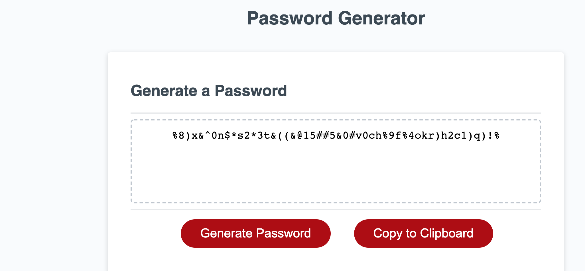

# Random-Password-Generator
The purpose for this project was to create a random password generator. The user clicks the Generate Password button and is prompted with options for length and characters. Based on the user's responses, we create a password using randomly generated characters. This application has been refactored to remove browser prompts and use checkboxes, and the code to generate the password has been largely reduced for simplicity's sake.

## Functionality
This tool features fields to choose a password length and which character types the user wants to include. If no characters are included the user will be alerted that they need to include at least one character type. If a length of less than eight (8) or more than one hundred twenty-eight (128) is entered, an alert will inform the user of the length restrictions. 

If at least one character type is true, the code will randomly choose between the character types once per character, and choose a random character from that type until the length is satisfied. The Copy to Clipboard button will copy the password automatically from the password box onto the user's clipboard. Once the password is copied the button text indicates "Copied!" to let the user know it was successful. When a new password is created, the old password is replaced by the new password and the button text returns to "Copy to Clipboard".

This tool is deployed via github [here](https://mat-lundin.github.io/Random-Password-Generator/)

